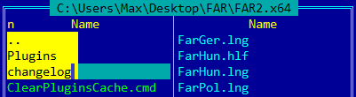


* <a title="Selection problem" class=closed_ref href="http://github.com/Maximus5/conemu-old-issues/issues/887">Issue 887&nbsp;</a>
* <a title="Selection problem" class=closed_ref href="http://github.com/Maximus5/conemu-old-issues/issues/1292">Issue 1292&nbsp;</a>
* <a title="Can I use Ctrl+Shift+Arrow to select and delete text?"  href="http://github.com/Maximus5/conemu-old-issues/issues/1332">Issue 1332</a>


# Copying and Pasting text in ConEmu consoles

ConEmu allows to select text using:

* ‘block’ (or ‘rectangular’) selection, like [real console](RealConsole.html) ‘Mark’ menu item,
  [Far Manager](FarManager.html) `Alt+Ins`, VisualStudio selection with `Alt+Shift` pressed;
* ‘text’ (or ‘stream’) selection, like standard GUI text editors.

**NB** Both types of selection may be done either from keyboard or mouse.

Marked text may be copied to Windows Clipboard using simple text format
or colorized HTML format ready to paste into blogs and aware editors.

And of course, pasting text either from clipboard or from selection
is supported too.

**NB** Copying text is doing ‘from screen’, that's why ConEmu can't
copy ‘real tab characters’ some console applications may print,
because they are expanded to ‘spaces’ when they come to screen.
Also, ConEmu's selection doesn't correspond to
[Far Manager](FarManager.html) editor or `Alt+Ins` selection.

<h2 id="settings"> Settings </h2>


* Выделение теперь может быть 'блочным' (как в обычной консоли) или 'текстовым' (как в текстовых редакторах).
* В меню окна добавлены пункты 'Mark block' и 'Mark text'.
* Добавлена настройка клавиш мышки и модификаторов. Теперь можно указать когда разрешено выделение мышкой:
  * Только при наличии прокрутки (Buffer only, по умолчанию), или всегда (Always).
  * Можно указать модификатор (Alt, Shift, ...) для обоих типов выделения (Block & Text).
  * Можно выбрать действия для правой и средней кнопки мышки (Copy/Paste).
  * Можно настроить цвет фона и текста для выделения.
* Снято ограничение на флажок 'Mouse' в FAR (его можно оставлять включенным).


